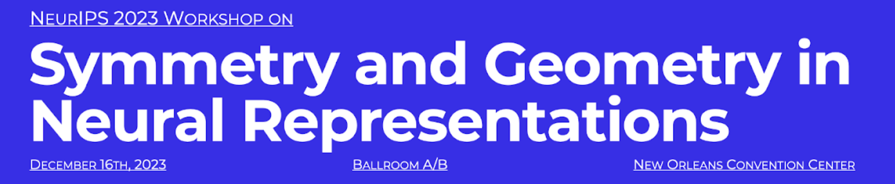

Together with [Sophia Sanborn](https://www.sophiasanborn.com/), [Christian Shewmake](https://www.christianshewmake.com/), and [Nina Miolane](https://www.ninamiolane.com/), I co-organized the 2nd edition of our Workshop on Symmetry and Geometry in Neural Representations (NeurReps 😉), at NeurIPS 2023. 

## Abstract

An emerging set of findings in sensory and motor neuroscience is beginning to illuminate a new paradigm for understanding the neural code. Across sensory and motor regions of the brain, neural circuits are found to mirror the geometric and topological structure of the systems they represent—either in their synaptic structure, or in the implicit manifold generated by their activity. This phenomenon can be observed in the circuit of neurons representing head direction in the fly (Kim et al. (2017); Wolff et al. (2015); Chaudhuri et al. (2019)), in the activities of grid cells (Gardner et al. (2022)), and in the low-dimensional manifold structure observed in motor cortex (Gallego et al. (2017)). This suggests a general computational strategy that is employed throughout the brain to preserve the geometric structure of data throughout stages of information processing.

					

Independently but convergently, this very same computational strategy has emerged in the field of deep learning. The nascent sub-field of Geometric Deep Learning (Bronstein et al. (2021)) incorporates geometric priors into artificial neural networks to preserve the geometry of signals as they are passed through layers of the network. This approach provably demonstrates gains in the computational efficiency, robustness, and generalization performance of these models.

The convergence of these findings suggests deep, substrate-agnostic principles for information processing. Symmetry and geometry were instrumental in unifying the models of 20th-century physics. Likewise, they have the potential to illuminate unifying principles for how neural systems form useful representations of the world.

The NeurReps Workshop brings together researchers from applied mathematics and deep learning with neuroscientists whose work reveals the elegant implementation of mathematical structure in biological neural circuitry. The first edition of NeurReps was held at NeurIPS 2022. The invited and contributed talks drew exciting connections between trends in geometric deep learning and neuroscience, emphasizing parallels between equivariant structures in brains and machines. This year's workshop will feature six invited talks covering emerging topics in geometric and topological deep learning, mechanistic interpretability, category theory for AI, geometric structure in LLMs, and geometric structure in the brain. 

### Previous Editions

[NeurReps 2022](https://sazio.github.io/neurreps2022)

### Links 

* [Official Webpage of NeurReps](https://www.neurreps.org)
* [NeurReps Reading List](https://github.com/neurreps/reading-list/)
