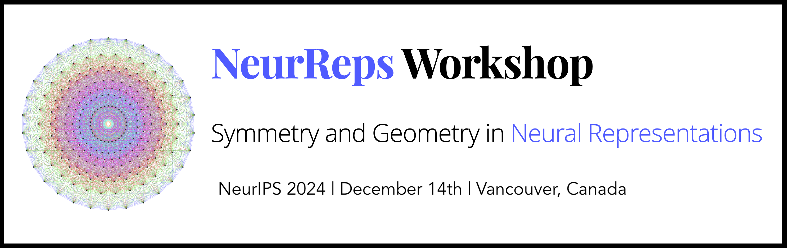

Together with [Sophia Sanborn](https://www.sophiasanborn.com/), [Christian Shewmake](https://www.christianshewmake.com/), [Arianna Di Bernardo](https://sites.google.com/view/arianna-di-bernardo/home-page) and [Nina Miolane](https://www.ninamiolane.com/), I co-organized the NeurIPS 2022 Workshop on Symmetry and Geometry in Neural Representations (NeurReps 😉)

## Abstract

In recent years, there has been a growing appreciation for the importance of modeling the geometric structure in data — a perspective that has developed in both the geometric deep learning and geometric statistics communities. In parallel, an emerging set of findings in neuroscience suggests that group-equivariance and the preservation of geometry and topology may be fundamental principles of neural coding in biology.
This workshop will bring together researchers from geometric deep learning and geometric statistics with theoretical and empirical neuroscientists whose work reveals the elegant implementation of geometric structure in biological neural circuitry. Group theory and geometry were instrumental in unifying models of fundamental forces and elementary particles in 20th-century physics. Likewise, they have the potential to unify our understanding of how neural systems form useful representations of the world.
The goal of this workshop is to unify the emerging paradigm shifts towards structured representations in deep networks and the geometric modeling of neural data — while promoting a solid mathematical foundation in algebra, geometry, and topology.

### Links 

* [Official Webpage of NeurReps](https://www.neurreps.org)
* [NeurReps Reading List](https://github.com/neurreps/reading-list/)
* [PMLR Proceedings](https://proceedings.mlr.press/v197/)
