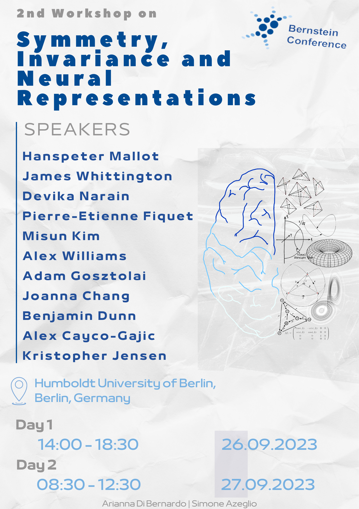

 
Together with Arianna Di Bernardo, I co-organized a 2nd edition of our workshop on the role of symmetry and invariance in neural representations which took place as part of the Bernstein 2023 Conference, in Berlin on September 26 and 27. 

## Abstract

The second workshop on symmetry, invariance, and nneural representations at the Bernstein Conference 2023 seeks to encourage interdisciplinary research at the intersection of mathematics and neuroscience. The workshop will emphasize the significance of symmetries in the structure and function of the brain and present the latest research on neural population geometry, neural manifolds, embeddings of neural data, and invariant/equivariant neural representations in both biological and artificial networks. By incorporating geometric and topological features, along with symmetry, into the design of neural architectures, researchers can develop more interpretable and trainable models, leading to a more profound comprehension of the brain and its complexities. This ongoing research area has the potential to transform our understanding of neural computation and information processing, opening doors to more robust and efficient neural models. Building on the feedback and interaction with peers from the previous year, the second edition of this workshop will bring together researchers and students from various fields to promote cooperation and push forward this exciting research area.

-----------
## Speakers 

------------

### Links

* [**Official Bernstein 2022 Workshop Webpage**](https://bernstein-network.de/bernstein-conference/program/satellite-workshops/symmetry-invariance-and-neural-representations/)
