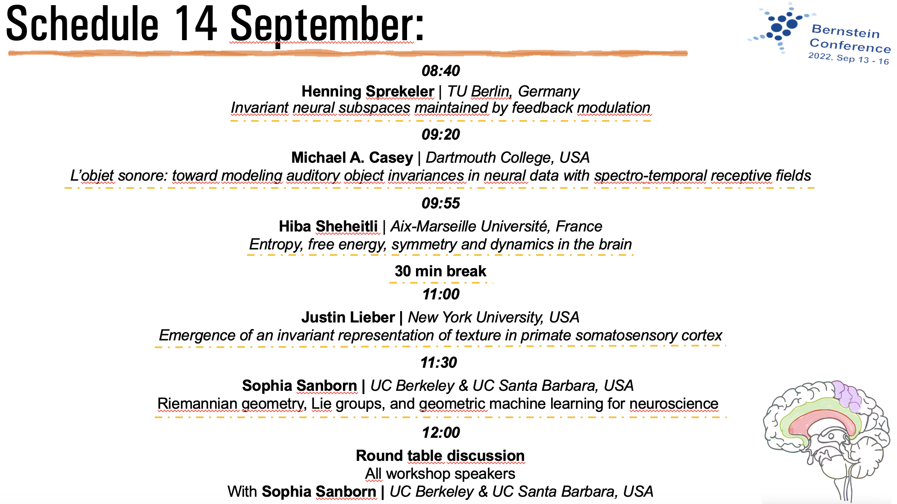

 
Together with Arianna Di Bernardo, I co-organized a workshop on the role of symmetry and invariance in neural representations which took place as part of the Bernstein 2022 Conference, in Berlin on September 13 and 14. 

## Abstract

Why does symmetry encoding matter for neuroscience? There exists an intimate relationship between how natural phenomena evolve in time and how we represent the world by measuring it with our senses. On the one hand, the best mathematical model of the world we possess, the physical laws, can be characterised on the basis of invariants, conserved quantities (Noether’s Theorem). On the other hand, in order to perceive and thus interact with the external environment, we need to create robust neural representations from the “data” collected through sensory processing.

It is therefore inevitable that neural representations, as well as the structure and dynamics of neuronal circuits, are affected by the organisational properties dictated by physics. Awareness of this fact and incorporating it in the definition of computational and deep learning models for brain function can allow for more robust learning and provide better generalisation properties. This workshop proposal aims to unify under a common framework, theories and models that consider invariant representations in vision, audition, olfaction, touch, motor control, spatial navigation and memory.

-----------
## Schedule 

-----------

------------

### Links

* [**Official Bernstein 2022 Workshop Webpage**](https://bernstein-network.de/bernstein-conference-interim/program/satellite-workshops/symmetry-invariance-and-neural-representations/)
