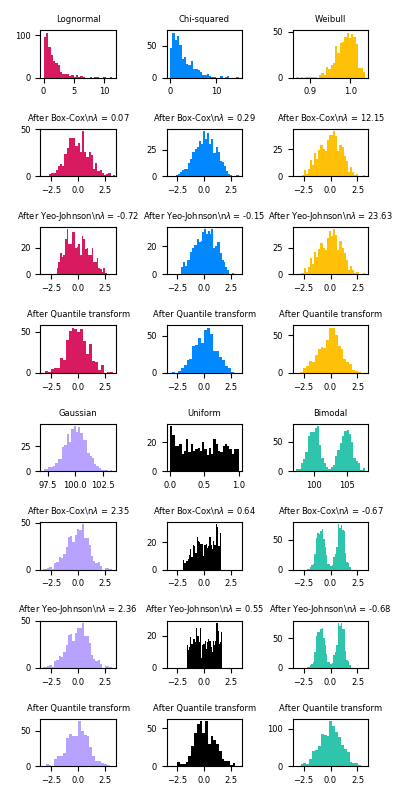

> This is the first article of a to-be series devoted to figure out a way to tackle a Machine Learning (ML) competition. A few months ago, the MLJC gained access to an international ML competition on climate change, organized by the University of Toronto: [www.projectx2020.com](http://www.projectx2020.com). This competition will start on September 2020, so we decided to start gathering some useful material related to competition dynamics such as Data Preprocessing, Feature Engineering and convert them in a lecture-like format.

In this first part, we’d like to tell you about some practical tricks for making **gradient descent** work well, in particular, we’re going to delve into feature scaling. As an introductory view, it seems reasonable to try to depict an intuition of the concept of _scale_.

### Macro, Meso, Micro-scale in Science

As scientists, we are well aware of the effects of using a specific measurement tool in order to characterize some quantity and describe reality. As an ideal example we consider the **length scale**.


We can identify three different points of view: _microscopic_, _mesoscopic_ and _macroscopic_; which are intimately related to the adopted lenght scale.

We usually deal with the _macroscopic scale_ when the observer is in such a position (pretty far, in terms of distance), with respect to the object, that she/he can describe its global characteristics. Instead, we do refer to the _microscopic scale_ when the observer is so close to the object that she/he can describe its atomistic details or elementary parts (e.g. molecules, atoms, quarks). Last but not least, we talk about _mesoscopic scale_ everytime we are in between micro and macro.

These definitions are deliberately vague, since delineating a precise and neat explanation would be higly difficult and complex, and it’s actually far from our purposes.

On the other side, this kind of introduction is quite useful, we should take a few minutes to think about the “active” role of the observer and about the fact that, to be honest, for every length scale, there’s some specific theory, i.e. there’s no global theory for a multi-scale description of some phenomenon.

### Scaling in Data Science

If our beloved observer (i.e. the scientist) has some kind of “privilege”, i.e. choosing the right measurement tool, which is nothing but choosing the right scale in the description of some phenomenon, we can’t really say the same for a data scientist.

It’s a sort of paradox, but a data scientist can’t really deal with data retrieval most of the times. Because of that, a data scientist is often left alone in front of data, without even knowing from which measurement tool they’re coming from. There’s no way to interact with the length scale for example.

Is there something that we can do about it? The only thing we can do is assuming that features are independent and scale these features in order to have something compatible from one to the other. This procedure is called **feature scaling**, and soon we’ll understand why it is useful even for ML algorithms, such as gradient descent.


If you make sure that features are on similar scales, i.e. features take on similar range of values, then gradient descent can converge more quickly.

More concretely, let’s say we have a problem with two features where **_x_**₁ is the length of a football field and take values between _90_ (meters) and _115_ (meters) and **_x_**₂ is the radius of a ball which takes values between _10.5_(centimeters) to _11.5_ (centimeters). If you plot the countours of the cost function **_J(ω)_** then you might get something similar to the _left plot_, and because of these very skewed elliptical shape, if we run gradient descent on this cost function, it may end up taking a long time and oscillating back and forth before reaching the global minimum.

In these settings, as stated previously, a useful thing to do is to scale the features. Generally, the idea is to get every feature into approximately a _\-1_ to _+1_ range. By doing this, we get the _right plot_. In this way, you can find a much more direct path to the global minimum rather than taking a much more convoluted path where you’re sort of trying to follow a very complicated trajectory.

### Preprocessing Data

> In any Machine Learning process, Data Preprocessing is that step in which the data gets transformed, or encoded, to bring it to such a state that now the machine can easily parse it. In other words, the features of the data can now be easily interpreted by the algorithm.

We’re going to dive into Scikit-Learn for this section and exploit its powerful _processing_ package.

We’ve been talking about scaling our data, now it’s time to understand how to put our hands on code and try to do that. Usually, as previously stated, learning algorithms benefit from standardization of the data set. If some outliers are present in the set, robust scalers or transformers might be more appropriate. (Take a look at [Compare the effect of different scalers on data with outliers](https://scikit-learn.org/stable/auto_examples/preprocessing/plot_all_scaling.html#sphx-glr-auto-examples-preprocessing-plot-all-scaling-py), you’ll see the behaviors of the different scalers, transformers and normalizers with outliers).

### Standardization

Many Machine Learning estimators require _standardization_ of datasets, elseways they might behave badly because data are far from a Gaussian (with zero mean and unit variance) distribution.

Most of the times, we ignore the shape of the distribution and just transform the data by subtracting the mean value of each feature, then scale by dividing features by their standard deviation.

_Do you have in mind some models that assume that all features are centered around zero and have variance in the same order of magnitude? Can you think about possible issues related to the objective function in these cases?_

A possible answer: many elements used in the objective function of a learning algorithm (such as the _RBF kernel_ of _Support Vector Machines_ or the _l1_ and _l2_ regularizers of linear models) assume that all features are centered around zero and have variance in the same order. If a feature has a variance that is orders of magnitude larger than others, it might dominate the objective function and make the estimator unable to learn from other features correctly as expected.

There’s a fast way to do that on a single array, by means of the _scale_ function.

```
from sklearn import preprocessing
import numpy as np
X_train = np.random.randint(5, size = (3,3))
X_scaled = preprocessing.scale(X_train)

print(X_train)
print(X_scaled)
print(X_scaled.mean(axis=0))
print(X_scaled.std(axis=0))
```

The _preprocessing_ module provides a utility class [_StandardScaler_](https://scikit-learn.org/stable/modules/generated/sklearn.preprocessing.StandardScaler.html#sklearn.preprocessing.StandardScaler) that compute the mean and std on a training set so as to be able to later reapply the same transform on the test set.

(You should be well aware of what [_sklearn.pipeline.Pipeline_](https://scikit-learn.org/stable/modules/generated/sklearn.pipeline.Pipeline.html#sklearn.pipeline.Pipeline) is, it’s crucial for strategies’ deployment.)

```

scaler = preprocessing.StandardScaler().fit(X_train)
print(scaler.mean_)
print(scaler.scale_)
print(scaler.transform(X_train))
```

Now we can use the scaler instance on new data, to transform them in the same way we did previously.

```
X_test = [[-1., 1., 0.]]
scaler.transform(X_test)
```

It is possible to disable centering or scaling by passing _with\_mean = False_ or _with\_std = False_. The first one might be particularly useful if applied to sparse CSR or CSC matrices to avoid breaking the sparsity structure of the data.

**Scaling Features to a Range**

Another standardization is scaling features to lie between a given minimum and maximum value, or so that the maximum absolute value of each future is scaled to unit size. This can be achieved with [_MinMaxScaler_](https://scikit-learn.org/stable/modules/generated/sklearn.preprocessing.MinMaxScaler.html#sklearn.preprocessing.MinMaxScaler) or [_MaxAbsScaler_](https://scikit-learn.org/stable/modules/generated/sklearn.preprocessing.MaxAbsScaler.html#sklearn.preprocessing.MaxAbsScaler).

Here you can see how to scale a toy data matrix to the _\[0,1\]_ range:

```
X_train = np.random.randint(10, size = (3,3))

min_max_scaler = preprocessing.MinMaxScaler()
X_train_minmax = min_max_scaler.fit_transform(X_train)
X_train_minmax
```

In the same way as above, the same instance of the transformer can be applied to some new test data: the same scaling and shifting will be applied to be consistent.

```
X_test = np.array([[-3., -1.,  4.]])
X_test_minmax = min_max_scaler.transform(X_test)
X_test_minmax
```

It’s pretty useful to let the scaler reveal some details about the transformation learned on the training data:

```
print(min_max_scaler.scale_)
print(min_max_scaler.min_)
```

Can you retrieve the explicit formula for _MinMaxScaler_?

Here’s the solution


_MaxAbsScaler_ works in a similar fashion, the data will lie in the range _\[-1,1\]_. It is meant for data that is already centered at zero or sparse data.

```
max_abs_scaler = preprocessing.MaxAbsScaler()
X_train_maxabs = max_abs_scaler.fit_transform(X_train)
X_train_maxabs
```

```
X_test_maxabs = max_abs_scaler.transform(X_test)
X_test_maxabs
```

```
max_abs_scaler.scale_
```


**Scaling Data with Outliers**

If our data contain many outliers, scaling using the mean and variance of the data is not likely to work well. In this case, we can use [_RobustScaler_](https://scikit-learn.org/stable/modules/generated/sklearn.preprocessing.RobustScaler.html#sklearn.preprocessing.RobustScaler).

This scaler removes the [median](https://en.wikipedia.org/wiki/Median) and scales data according to the [IQR](https://en.wikipedia.org/wiki/Interquartile_range) (InterQuartile Range).

Centering and scaling happen independently on each feature by computing the relevant statistics on the samples in the training set.

```
from sklearn.preprocessing import RobustScaler
X_train = [[ 1., -2.,  2.],
     [ -2.,  1.,  3.],
     [ 40.,  1., -2.]]
transformer = RobustScaler().fit(X_train)
transformer.transform(X_train)
```

Median and interquartile range are then stored to be used on later data using the _transform_ method.

### Non-linear transformations

It’s possible to generalize to non-linear transformations. We are going to talk about two types of transformations: _quantile transforms_ and _power transforms_. The main take-home message is that we need _monotonic_ transformations to preserve the rank of the values along with each feature.

Quantile transforms smooth out unusual distributions and is less influenced by outliers than scaling methods. It does distort correlations and distances within and across features.

Power transforms are, indeed, a family of parametric transformations that aim to map data from any distribution to as close to a Gaussian distribution.

**Mapping to a Uniform Distribution**

[_QuantileTransformer_](https://scikit-learn.org/stable/modules/generated/sklearn.preprocessing.QuantileTransformer.html#sklearn.preprocessing.QuantileTransformer) provides a non-parametric transformation to map the data to a uniform distribution with values between 0 and 1:

```
from sklearn.datasets import load_iris
from sklearn.model_selection import train_test_split
# load dataset
X, y = load_iris(return_X_y=True)
# train test splitting
X_train, X_test, y_train, y_test = train_test_split(X, y, random_state=0)
# Quantile transform
quantile_transformer = preprocessing.QuantileTransformer(random_state=0)
X_train_trans = quantile_transformer.fit_transform(X_train)
X_test_trans = quantile_transformer.transform(X_test)
np.percentile(X_train[:, 0], [0, 25, 50, 75, 100]) 
```

This feature corresponds to the sepal length in cm. Once the quantile transform is applied, those landmarks approach closely the percentiles previously defined

```
np.percentile(X_train_trans[:, 0], [0, 25, 50, 75, 100])
```

Some more applications [here](https://machinelearningmastery.com/quantile-transforms-for-machine-learning/).

**Mapping to a Gaussian Distribution**

Many machine learning algorithms prefer or perform better when numerical input variables and even output variables in the case of regression have a Gaussian distribution. Power transforms are a family of parametric, monotonic transforms that aim to map data from any distribution to as close to a Gaussian distribution as possible, in order to stabilize variance and minimize skewness.

[_PowerTransformer_](https://scikit-learn.org/stable/modules/generated/sklearn.preprocessing.PowerTransformer.html#sklearn.preprocessing.PowerTransformer) provides two transformations, the _Yeo-Johnson_ transform:


and the _Box-Cox_ transform:


Box-Cox can only be applied to strictly positive data. In both methods, the transformation is parametrized by $\\lambda$, which is determined through maximum-likelihood estimation. Here is an example of using Box-Cox to map samples drawn from a lognormal distribution to a normal distribution:

```
pt = preprocessing.PowerTransformer(method='box-cox', standardize=False)
X_lognormal = np.random.RandomState(616).lognormal(size=(3, 3))
pt.fit_transform(X_lognormal)
```

(Some more applications [here](https://machinelearningmastery.com/power-transforms-with-scikit-learn/))

Below are some examples of the two transforms applied to various probability distributions, _any comment_?



### Normalization

As scientists, we feel much more comfortable with Vector Space Models. _Normalization_ is the process of scaling individual samples to have a unit norm. This process might be useful if we plan to use a dot-product or some kernel to quantify similarities of pairs of samples.

The function provides a quick and easy way to perform this operation on a single array, using [L1 or L2 norms](https://medium.com/@montjoile/l0-norm-l1-norm-l2-norm-l-infinity-norm-7a7d18a4f40c):

```
X = [[ 1., -1.,  2.],
     [ 2.,  0.,  0.],
     [ 0.,  1., -1.]]
X_normalized = preprocessing.normalize(X, norm='l2')

X_normalized
```

The _preprocessing_ module provides a utility class _Normalizer_ that implements the same operation using the _Transformer_ API. This class is suitable for _sklearn.pipeline.Pipeline_

```
normalizer = preprocessing.Normalizer().fit(X)  # fit does nothing
normalizer.transform(X)
```

```
normalizer.transform([[-1.,1.,0.]])
```

### Encoding Categorical Features

In many cases, features are not continous values but categorical. E.g. a person could have some features: `["from Italy", "from France", "from Germany"]`, `["play sports", "doesn't play sports"]`, `["uses Firefox", "uses Opera", "uses Chrome", "uses Safari", "uses Internet Explorer"]`.

Such features can be efficiently coded as integers, for instance `["from France", "play sports", "uses Chrome"]` could be `[1,0,2]`.

To convert categorical features to such integer codes, we can use the [_OrdinalEncoder_](https://scikit-learn.org/stable/modules/generated/sklearn.preprocessing.OrdinalEncoder.html#sklearn.preprocessing.OrdinalEncoder). In this way, we transform each feature to one new feature of integers _(0_ to _n\_categories-1)_:

```
enc = preprocessing.OrdinalEncoder()
X = [['from Italy', 'play sports', 'uses Safari'], ['from Germany', "doesn't play sports", 'uses Firefox']]
enc.fit(X)

print(enc.transform([['from Germany', "doesn't play sports", 'uses Firefox']]))
print(enc.transform([['from Italy', 'play sports', 'uses Safari']]))

print(enc.transform([['from Germany', 'play sports', 'uses Safari']]))
```

Some scikit-learn estimators expect continuous input and would interpret categories as ordered, which is usually not desired.

There’s another way to convert categorical features to features that can be used with scikit-learn estimators: _one-hot encoding_. It can be obtained with the [_OneHotEncoder_](https://scikit-learn.org/stable/modules/generated/sklearn.preprocessing.OneHotEncoder.html#sklearn.preprocessing.OneHotEncoder), which transforms each categorical feature with `n_categories`possible values into `n_categories` binary features, with one of them 1, and all others 0.

Let’s continue with the example above:

```
enc = preprocessing.OneHotEncoder()
X = [['from Italy', 'play sports', 'uses Safari'], ['from Germany', "doesn't play sports", 'uses Firefox']]
enc.fit(X)

print(enc.transform([['from Germany', "doesn't play sports", 'uses Firefox']]).toarray())
print(enc.transform([['from Italy', 'play sports', 'uses Safari']]).toarray())

print(enc.transform([['from Germany', 'play sports', 'uses Safari']]).toarray())
```

The values each feature can take is inferred automatically from the dataset and can be found in the `categories_` attribute:

We are done with a brief introduction to Data Preprocessing. I’ve tried to show some of the most useful features of _scikit-learn,_ which is definitely one of the cardinal libraries for ML. In the next lecture, we are going to dive into Feature Engineering, which I personally consider the most fundamental part of a ML pipeline. Stay tuned for the next article !👩‍💻👨‍💻
