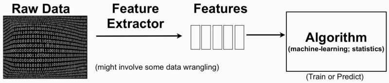

> After having read the [first article](https://medium.com/mljcunito/data-spectrometry-or-how-to-preprocess-your-data-2a6593ee5dbb) of this series, devoted to figuring out a way to tackle a Machine Learning (ML) competition, we are now ready to go on with Feature Engineering, and, in particular Feature Importance.

The real deal is that nobody explicitly tells you what **feature engineering** is, in some way, you are expected to understand for yourself what are good features.



> Feature engineering is another topic that doesn’t seem to merit any review papers or books or even chapters in books, but it is absolutely vital to ML success. \[…\] Much of the success of machine learning is actually success in engineering features that a learner can understand.

> (Scott Locklin, in “Neglected machine learning ideas”)

Let’s try to figure out what feature engineering is.

In solving such problems, our goal is to get the best possible result from a model. In order to achieve that, we need to extract useful information and get the most from what we have. On one side, this includes getting the best possible result from the algorithms we are employing. On the other side, it also involves getting the most out of the available data.

_How do we get the most out of our data for predictive modeling?_

Feature engineering tries to find an answer to this question.

> Actually, the success of all Machine Learning algorithms depends on how you present the data.

> ( Mohammad Pezeshki, answer to “What are some general tips on feature selection and engineering that every data scientist should know?”)

### Feature Importance

Feature importance refers to a bunch of techniques that assign a score to input features based on how useful they are at predicting a target variable. These scores play an important role in predictive modeling, they usually provide useful insights into the dataset and the basis for dimensionality reduction and feature selection.

Feature importance scores can be calculated both for regression and classification problems.

These scores can be used in a range of situations, such as:

*   _Better understanding the data_: the relative scorse can highlight which features may be most relevant to the target, and on the other side, which are least relevant. This could be a useful notion for a domain expert and could be used as a basis for gathering more or different data.
*   _Better understanding a model_: inspecting the importance score provides insights into the specific model we’re using and which features are the most important to the model when elaborating a prediction.
*   _Reducing the number of input features_: we can use the importance scores to select those features to delete (lowest score) and those to keep (highest scores).

Now let’s jot down a few lines of code in order to grasp this topic in a better way. In order to explore feature importance scores, we’ll import a few test datasets directly from _sklearn_.

**Classification Dataset**

Easy peasy, we can use the [_make\_classification()_](https://scikit-learn.org/stable/modules/generated/sklearn.datasets.make_classification.html) function to create a test binary classification dataset.

We can specify the number of samples and the number of features, some of them are going to be informative and the remaining redundant. (_Tip_: you should fix the _random seed_, in this way you’ll get a reproducible result)

```
# classification dataset
from sklearn.datasets import make_classification
# define dataset
X_clf, y_clf = make_classification(n_samples=1000, n_features=8, n_informative=3, n_redundant=5, random_state=1)
# summarize the dataset
print(X_clf.shape, y_clf.shape)
```


**Regression Dataset**

In a parallel fashion, we’ll use the [_make\_regression()_](https://machinelearningmastery.com/calculate-feature-importance-with-python/#:~:text=Feature%20importance%20refers%20to%20techniques,at%20predicting%20a%20target%20variable.) function to create a regression dataset.

```
# test regression dataset
from sklearn.datasets import make_regression
# define a dataset
X_reg, y_reg = make_regression(n_samples=1000, n_features=8, n_informative=3, random_state=1)
# summarize the dataset
print(X_reg.shape, y_reg.shape)
```

### Coefficients as Feature Importance

When we think about linear machine learning algorithms, we always fit a model where the prediction is the weighted sum of the input values (e.g. linear regression, logistic regression, ridge regression, etc...)

These coefficients can be used directly as naive feature importance scores. Firstly we’ll fit a model on the dataset to find the coefficients, then summarize the importance scores for each input feature and create a bar chart to get an idea of the relative importance.

**Linear Regression Feature Importance**

It’s time to fit a [_LinearRegression()_](https://scikit-learn.org/stable/modules/generated/sklearn.linear_model.LinearRegression.html) model on the regression dataset and get the _coef\__ property that contains the coefficients. The only assumption is that the input variables have the same scale or have been scaled prior to fitting the model.

This same approach can be used with regularized linear models, such as Ridge and ElasticNet.

```
# linear regression feature importance
from sklearn.linear_model import LinearRegression
from matplotlib import pyplot as plt 
# define the model
model = LinearRegression()
# fit the model
model.fit(X_reg, y_reg)
# get importance
importance = model.coef_
# summarize feature importance
for i,v in enumerate(importance):
	print('Feature: %0d, Score: %.5f' % (i,v))
# plot feature importance
plt.figure(figsize = (10,6))
plt.bar([x for x in range(len(importance))], importance)
plt.show()
```

**Logistic Regression Feature Importance**

In a similar fashion, we can do the same to fit a [_LogisticRegression()_](https://scikit-learn.org/stable/modules/generated/sklearn.linear_model.LogisticRegression.html) model.

```
# logistic regression for feature importance
from sklearn.linear_model import LogisticRegression
from matplotlib import pyplot as plt
# define the model
model = LogisticRegression()
# fit the model
model.fit(X_clf, y_clf)
# get importance
importance = model.coef_[0]
# summarize feature importance
for i,v in enumerate(importance):
	print('Feature: %0d, Score: %.5f' % (i,v))
# plot feature importance
plt.bar([x for x in range(len(importance))], importance)
plt.show()
```

Recall that this is a classification problem with classes 0 and 1 (binary). Notice that the coefficients are both positive and negative, positive scores indicate a feature that predicts class 1 while negative scores indicate a feature that predicts class 0.

_Why can’t we analyze a regression problem with Logistic Regression?_ (A pretty naive question, try to answer tho)

### Decision Tree Feature Importance

Decision Tree algorithms like **C**lassification **A**nd **R**egression **T**rees ( **CART**) offer importance scores based on the reduction in the criterion used to select split points, like Gini or Entropy. This approach can be also used for ensembles of decision trees, such as Random Forest and Gradient Boosting algorithms.

We can directly use the CART algorithm for feature importance implemented in Scikit-Learn as the [_DecisionTreeRegressor_](https://scikit-learn.org/stable/modules/generated/sklearn.tree.DecisionTreeRegressor.html) and [_DecisionTreeClassifier_](https://scikit-learn.org/stable/modules/generated/sklearn.tree.DecisionTreeClassifier.html).

The model provides a _feature\_importances\__ property that tells us the relative importance scores for each feature.

**CART Regression Feature Importance**

```
# decision tree for feature importance on a regression problem
from sklearn.tree import DecisionTreeRegressor
from matplotlib import pyplot as plt
# define the model
model = DecisionTreeRegressor()
# fit the model
model.fit(X_reg, y_reg)
# get importance
importance = model.feature_importances_
# summarize feature importance
for i,v in enumerate(importance):
	print('Feature: %0d, Score: %.5f' % (i,v))
# plot feature importance
plt.bar([x for x in range(len(importance))], importance)
plt.show()
```


**CART Classification Feature Importance**

```
# decision tree for feature importance on a classification problem
from sklearn.tree import DecisionTreeClassifier
from matplotlib import pyplot as plt
# define the model
model = DecisionTreeClassifier()
# fit the model
model.fit(X_clf, y_clf)
# get importance
importance = model.feature_importances_
# summarize feature importance
for i,v in enumerate(importance):
	print('Feature: %0d, Score: %.5f' % (i,v))
# plot feature importance
plt.bar([x for x in range(len(importance))], importance)
plt.show()
```

### Random Forest Feature Importance

Analogously, we can use the RandomForest algorithm for feature importance implemented in scikit-learn as the [_RandomForestRegressor_](https://scikit-learn.org/stable/modules/generated/sklearn.ensemble.RandomForestRegressor.html) and [_RandomForestClassifier_](https://scikit-learn.org/stable/modules/generated/sklearn.ensemble.RandomForestClassifier.html).

As above, the model provides a _feature\_importances\__ property.

**Random Forest Regression Feature Importance**

```
# random forest for feature importance on a regression problem
from sklearn.ensemble import RandomForestRegressor
from matplotlib import pyplot as plt
# define the model
model = RandomForestRegressor()
# fit the model
model.fit(X_reg, y_reg)
# get importance
importance = model.feature_importances_
# summarize feature importance
for i,v in enumerate(importance):
	print('Feature: %0d, Score: %.5f' % (i,v))
# plot feature importance
plt.bar([x for x in range(len(importance))], importance)
plt.show()
view raw
```

**Random Forest Classification Feature Importance**

```
# random forest for feature importance on a classification problem
from sklearn.ensemble import RandomForestClassifier
from matplotlib import pyplot as plt
# define the model
model = RandomForestClassifier()
# fit the model
model.fit(X_clf, y_clf)
# get importance
importance = model.feature_importances_
# summarize feature importance
for i,v in enumerate(importance):
	print('Feature: %0d, Score: %.5f' % (i,v))
# plot feature importance
plt.bar([x for x in range(len(importance))], importance)
plt.show()
```

### XGBoost Feature Importance

[XGBoost](https://xgboost.readthedocs.io/en/latest/index.html) is a Python library that provides an efficient implementation of the stochastic gradient boosting algorithm. (For an introduction to Boosted Trees, you can take a look [here](https://xgboost.readthedocs.io/en/latest/tutorials/model.html))

This algorithm can be integrated with Scikit-Learn via the _XGBRegressor_ and _XGBClassifier_ classes.

Even in this one, we can find the _feature\_importances\__ property.

First, let’s install the XGBoost library, with pip:

```
!pip install xgboost

# Check xgboost version
import xgboost
print(xgboost.__version__)
```

Now, let’s take a look at an example of XGBoost for feature importance.

**XGBoost Regression Feature Importance**

```
# xgboost for feature importance on a regression problem
from xgboost import XGBRegressor
from matplotlib import pyplot as plt
# define the model
model = XGBRegressor()
# fit the model
model.fit(X_reg, y_reg)
# get importance
importance = model.feature_importances_
# summarize feature importance
for i,v in enumerate(importance):
	print('Feature: %0d, Score: %.5f' % (i,v))
# plot feature importance
plt.bar([x for x in range(len(importance))], importance)
plt.show()
```

**XGBoost Classification Feature Importance**

```
# xgboost for feature importance on a classification problem
from xgboost import XGBClassifier
from matplotlib import pyplot
# define the model
model = XGBClassifier()
# fit the model
model.fit(X_clf, y_clf)
# get importance
importance = model.feature_importances_
# summarize feature importance
for i,v in enumerate(importance):
	print('Feature: %0d, Score: %.5f' % (i,v))
# plot feature importance
pyplot.bar([x for x in range(len(importance))], importance)
pyplot.show()
```

Permutation feature importance is a technique for calculating relative importance scores that is independent of the model used. It measures the increase in the prediction error of the model after we permuted the feature’s values, which breaks the relationship between the feature and the true outcome.

The concept is really straightforward: we measure the importance of a feature by calculating the increase in the model’s prediction error after permuting the feature. A feature is “important” if shuffling its values increases the model error because in this case, the model relied on the feature for the prediction. A feature is “unimportant” if shuffling its values leaves the model error unchanged because in this case, the model ignored the feature for the prediction.

Permutation feature selection can be used via the [_permutation\_importance()_](https://scikit-learn.org/stable/modules/generated/sklearn.inspection.permutation_importance.html) function that takes a fit model, a dataset, and a scoring function.

Let’s try this approach with an algorithm that doesn’t support feature selection natively, [KNN](https://en.wikipedia.org/wiki/K-nearest_neighbors_algorithm) (K-Nearest Neighbors).

**Permutation Feature Importance for Regression**

```
# permutation feature importance with knn for regression
from sklearn.neighbors import KNeighborsRegressor
from sklearn.inspection import permutation_importance
from matplotlib import pyplot as plt 
# define the model
model = KNeighborsRegressor()
# fit the model
model.fit(X_reg, y_reg)
# perform permutation importance
results = permutation_importance(model, X_reg, y_reg, scoring='neg_mean_squared_error')
# get importance
importance = results.importances_mean
# summarize feature importance
for i,v in enumerate(importance):
	print('Feature: %0d, Score: %.5f' % (i,v))
# plot feature importance
plt.bar([x for x in range(len(importance))], importance)
plt.show()
```

**Permutation Feature Importance for Classification**

```
# permutation feature importance with knn for classification
from sklearn.neighbors import KNeighborsClassifier
from sklearn.inspection import permutation_importance
from matplotlib import pyplot as plt
# define the model
model = KNeighborsClassifier()
# fit the model
model.fit(X_clf, y_clf)
# perform permutation importance
results = permutation_importance(model, X_clf, y_clf, scoring='accuracy')
# get importance
importance = results.importances_mean
# summarize feature importance
for i,v in enumerate(importance):
	print('Feature: %0d, Score: %.5f' % (i,v))
# plot feature importance
plt.bar([x for x in range(len(importance))], importance)
plt.show()
```

**Feature Selection with Importance**

Feature importance scores can be used to find useful insights and interpret the data, but they can also be used directly to help rank and select features that are most useful. This procedure is usually referred to as _Feature Selection_, and we’ll look at it in more detail soon.

In our case, we can show how is possible to find redundant features by using the previously shown techniques.

Firstly, we can split the dataset into train and test sets, train a model on the training set, make predictions on the test set and evaluate the results by employing classification accuracy. We’ll use a Logistic Regression model to fit our data.

```
from sklearn.model_selection import train_test_split
from sklearn.linear_model import LogisticRegression
from sklearn.metrics import accuracy_score
# split into train and test sets
X_train, X_test, y_train, y_test = train_test_split(X_clf, y_clf, test_size=0.33, random_state=1)
# fit the model
model = LogisticRegression(solver='liblinear')
model.fit(X_train, y_train)
# evaluate the model
yhat = model.predict(X_test)
# evaluate predictions
accuracy = accuracy_score(y_test, yhat)
print('Accuracy: %.2f' % (accuracy*100))
```

In this case, we can see that our model achieved a classification accuracy of about _86.67 %_ using all the features in the dataset.

Let’s see what happens if we select only relevant features. We could use any of the feature importance scores above, but in this case, we’ll use the ones provided by random forest.

We can use the [_SelectFromModel_](https://scikit-learn.org/stable/modules/generated/sklearn.feature_selection.SelectFromModel.html) class to define both the model and the number of features to select.

```
from sklearn.feature_selection import SelectFromModel
# configure to select a subset of features
fs = SelectFromModel(RandomForestClassifier(n_estimators=200), max_features=5)
```

This will calculate the importance scores that can be used to rank all input features. We can then apply the method as a transform to select a subset of the 5 most important features from the dataset. This transform will be applied to the training set and the test set.

```
# learn relationship from training data
fs.fit(X_train, y_train)
# transform train input data
X_train_fs = fs.transform(X_train)
# transform test input data
X_test_fs = fs.transform(X_test)
```

We can wrap up every piece and get this code snippet.

```
# evaluation of a model using 5 features chosen with random forest importance
from sklearn.model_selection import train_test_split
from sklearn.feature_selection import SelectFromModel
from sklearn.ensemble import RandomForestClassifier
from sklearn.linear_model import LogisticRegression
from sklearn.metrics import accuracy_score

# feature selection
def select_features(X_train, y_train, X_test):
	# configure to select a subset of features
	fs = SelectFromModel(RandomForestClassifier(n_estimators=1000), max_features=5)
	# learn relationship from training data
	fs.fit(X_train, y_train)
	# transform train input data
	X_train_fs = fs.transform(X_train)
	# transform test input data
	X_test_fs = fs.transform(X_test)
	return X_train_fs, X_test_fs, fs

# split into train and test sets
X_train, X_test, y_train, y_test = train_test_split(X_clf, y_clf, test_size=0.33, random_state=1)
# feature selection
X_train_fs, X_test_fs, fs = select_features(X_train, y_train, X_test)
# fit the model
model = LogisticRegression(solver='liblinear')
model.fit(X_train_fs, y_train)
# evaluate the model
yhat = model.predict(X_test_fs)
# evaluate predictions
accuracy = accuracy_score(y_test, yhat)
print('Accuracy: %.2f' % (accuracy*100))
```

In this case, we can see that the model achieves the same performance on the dataset, although with almost half of the features.


It’s time to press the pause button, for now, you should take a look at the code above and try to tweak some parameters, you might find better results too. In the next article we’ll cover Feature Selection and Feature Extraction, stay tuned! 👩‍💻👨‍💻
